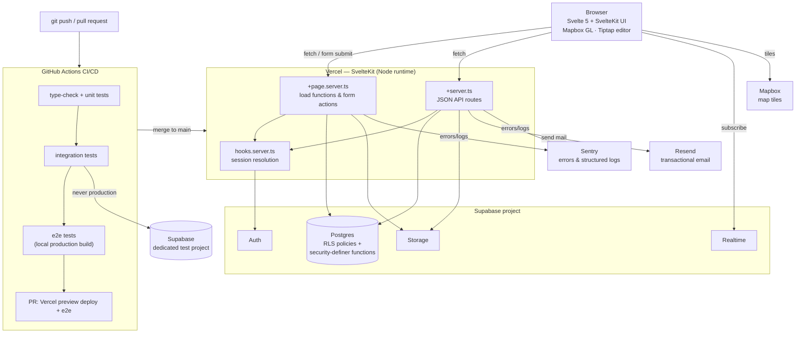
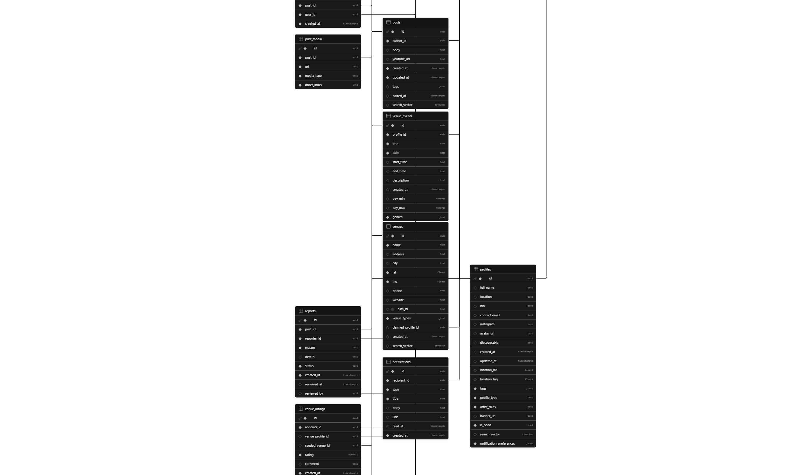

# OpenMic

A social platform connecting musicians and venues — artists build a public
presence and find places to play; venues post events with open performance
slots, review applicants, and book acts directly through the app.

[](https://github.com/Gabe-Alonso/OpenMic/actions/workflows/ci.yml)

**Live app:** https://open-mic-five.vercel.app

**Demo video:** _coming soon_

## Features

- **Artist & venue profiles** — geolocated, with a map view of nearby artists
  and venues (Mapbox).
- **Posts & feed** — rich-text posts with images, YouTube embeds, and tags,
  across three feed modes: Discover (engagement-ranked), Local (geo radius),
  and Following. Likes, reposts, and threaded comments, all with live
  counts and per-viewer state.
- **Reposts** — reposting surfaces a post in the reposter's followers'
  Following feed, tagged with who reposted it, without duplicating the
  underlying content.
- **Messaging** — one-on-one and group DMs with realtime delivery, typing
  indicators, and read receipts.
- **Full-text search** — across posts, profiles, and venues.
- **Venue events & booking** — a venue posts an event with one or more
  performance slots; artists apply with a message, or a venue can privately
  invite a specific artist before opening a slot to everyone. The venue
  reviews applicants (profile, message, accept/reject) from a dedicated
  management view, and the accepted artist locks into the slot on the
  venue's public calendar.
- **Venue claiming** — a venue listing (seeded from public data) stays
  visible and reviewable before anyone has claimed it. Claiming
  auto-approves instantly when the claimant's account email domain matches
  the venue's listed website; everything else queues for manual admin
  review — the same pattern Google/Yelp use for business verification.
- **Ratings & reviews** — half-star-granularity venue ratings with a
  comment thread, previewed on the venue's page.
- **Notifications** — in-app and email, independently toggleable per
  notification type and per channel, including geo-filtered "an event
  opened near you" alerts with distance/pay/genre filters.
- **Moderation** — post reporting with an admin review queue.
- **Abuse prevention** — Postgres-backed rate limiting on write-heavy
  endpoints.

## Architecture



**How a request actually flows:** the browser hits a SvelteKit route; a
`load` function or form action runs server-side using a Supabase client
scoped to that visitor's own session, so Postgres's row-level security
policies — not application code — are the real authorization boundary. A
handful of state changes that touch multiple tables at once (locking a
performance slot to an accepted applicant, approving a venue claim) go
through a `security definer` Postgres function via `.rpc()` instead of a
sequence of independent writes, so they can't partially succeed. Service-role
access is confined to a single shared admin client, used only where RLS
would otherwise block a legitimate cross-user write (sending someone else a
notification, an admin approving a claim).

### Database schema



## Decisions & tradeoffs

**Postgres-native geo, not PostGIS.** Nearby-artist and nearby-venue queries
use an indexed lat/lng bounding-box prefilter (`src/lib/server/geo.ts`) plus
an exact Haversine distance check in application code, rather than a
PostGIS `geography` column with a GiST index. At this app's current scale
the two-step filter is fast enough, and it avoids a schema migration and a
dependency most of the codebase doesn't otherwise need. The tradeoff is
explicit and already called out in the code: if the data grows by orders
of magnitude, the bounding box's unindexed secondary filter is the first
thing that will need to become a real spatial index.

**Keyset pagination everywhere, including across a feed merged from two
sources.** Every paginated list pages by `(created_at, id) < cursor`
rather than `OFFSET`, so pages stay correct as the underlying table changes
between requests instead of silently skipping or duplicating rows. The
Following feed pushes this further: a repost surfaces someone else's post
on its own timestamp, not the original author's, so it's effectively a
second, independently-paginated stream merged into the same chronological
page (`src/lib/server/feed.ts`). Each stream's cursor only advances as far
as it was actually represented in a given page — getting that detail wrong
is exactly the kind of bug that would never show up in a quick manual check,
only partway through a long infinite scroll.

**Security-definer Postgres functions for multi-row state transitions.**
A few transitions — accepting a performance-slot application (which locks
the slot and rejects every sibling application in the same instant),
creating or resolving a private slot offer — touch more than one row that
has to move together. These are implemented as `security definer` Postgres
functions called via `.rpc()`, not as sequential writes from the app server.
Sequential writes reopen a real failure mode: one write silently succeeding
while a dependent write doesn't, with no exception raised — concretely hit
once during development (a venue-claim approval that reported success while
the underlying row stayed unclaimed) and only caught because an integration
test checked the database's actual state, not just the action's reported
result.

**Row-level security as the actual authorization boundary.** Every table's
access rules are enforced in Postgres, not just in route handlers, so a bug
in a route's own filtering logic degrades to "the write matched zero rows,"
not "the wrong user's data got exposed or modified." This is tested
directly: several integration tests skip the app's routes entirely and
issue a write straight from an unauthorized user's own Supabase client,
asserting that RLS — not the route — is what refuses it.

**Rate limiting lives in Postgres, not Redis.** A fixed-window counter
implemented as a Postgres function, called the same way any other query is.
The alternative (Upstash/Redis) would have meant propagating a new secret
across three separate environments — Vercel production, Vercel preview, and
GitHub Actions — for a feature that's abuse-prevention, not an auth
boundary. It also fails *open*: if the rate-limit check itself errors, the
request is allowed rather than blocked, so an outage in the limiter can't
take down every write in the app. (Elsewhere, a filter-matching check for
notification delivery deliberately fails *closed* instead — the two
functions chose opposite defaults on purpose, based on what's actually at
stake if each one gets it wrong.)

**Integration tests run against a second, real Supabase project — never
mocks, never production.** They create and tear down real auth users and
rows, exercising the actual RLS policies and constraints rather than a
mocked client that could quietly drift from what the database really
enforces. CI never holds credentials for the production project.

**Venue claiming follows an existing verification pattern (Google/Yelp)
instead of a bespoke design.** A claim auto-approves instantly when the
claimant's account email domain matches the venue's listed website;
everything else queues into the same admin review flow already built for
content moderation, rather than a second, parallel review system. Venues
stay visible and browsable on the platform before anyone claims them,
matching how the rest of the venue directory already works.

**The HTML sanitizer's allowlist excludes links, on purpose, and stayed
that way.** Post bodies render through DOMPurify with an explicit
tag/attribute allowlist. When a feature wanted a clickable link inside an
auto-generated post, the fix was routing around it — linking through the
post author's existing profile link instead — rather than widening the
allowlist for every user's post just to support one feature. Widening a
sanitizer's allowlist is a security-surface decision, not a styling one,
and it wasn't worth making for a cosmetic win.

## Tech stack

| Layer | Choices |
|---|---|
| Frontend | SvelteKit 2, Svelte 5 (runes), TypeScript, Mapbox GL JS, Tiptap |
| Backend | SvelteKit server routes/actions, Supabase (Postgres, Auth, Storage, Realtime) |
| Data | Row-level security, security-definer Postgres functions, full-text search (`tsvector`/GIN/`ts_rank`), keyset pagination |
| Email | Resend |
| Testing | Vitest (unit + integration against a dedicated Supabase project), Playwright (e2e) |
| Observability | Sentry (errors + structured logs) |
| Deploy / CI | Vercel, GitHub Actions |

## Getting started

```bash
npm install
cp .env.example .env   # fill in your Supabase project + Mapbox token
npm run dev
```

Required environment variables are documented in `.env.example`. At minimum
you'll need a Supabase project (URL, anon key, service role key) and a
Mapbox token for the map views; `RESEND_API_KEY` and `PUBLIC_SENTRY_DSN` are
optional — email sending and error reporting no-op cleanly without them.

## Testing

```bash
npm run test:unit         # pure-function unit tests
npm run test:integration  # against a dedicated TEST_SUPABASE_* project — see .env.example
npm run test:e2e          # Playwright, against a local build by default
```

CI (`.github/workflows/ci.yml`) runs all three, plus — on pull requests — a
Vercel preview deploy followed by e2e tests against that live preview.
